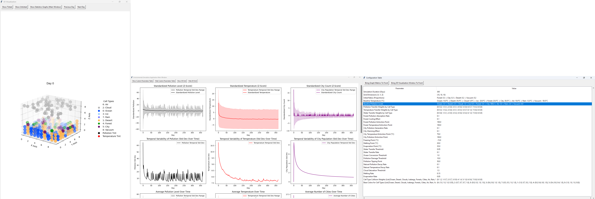

Here is the updated README file with added emojis to enhance its visual appeal:

```markdown
# 🚀 Cellular Automaton Simulation for Biological Computation (Maman 11)


## 📜 Overview
This project is a **cellular automaton simulation** developed as an academic task for the **Biological Computation Course**. It models complex environmental interactions using a particle-based system.

## ✨ Features
- **Educational Focus**: Designed to demonstrate the capabilities of cellular automata for academic study and research.
- **Complete Configuration Control**: Configure properties for every aspect of the simulation, including pollution dynamics, temperature changes, water transfer, and more.
- **Robust Core Logic**: The heart of the simulation lies in the `core` folder, which meticulously implements the cellular automaton behavior.
- **Graphical User Interface**:
  - Real-time visualization of simulation results
- **Logging**:
  - Info-level messages printed to the console
  - Detailed debug logs saved to `simulation.log`

## 🗂 Project Structure
```plaintext
├── main.py                     # Main entry point for the simulation
├── config/                     # Configuration management files
│   ├── presets.py              # Presets for simulation configuration
│   └── Config.py               # Handles configuration validation and updates (Config Singleton Instance)
├── core/                       # Core simulation logic
│   ├── Particle.py             # Manages particle behavior in the simulation
│   ├── Simulation.py           # Main simulation engine
│   ├── World.py                # Manages the simulation world/environment
│   └── __init__.py             # Initialization file for the core module
├── display/                    # Visualization components
│   ├── MatplotlibDisplay.py    # Handles Matplotlib-based visualization
│   └── __init__.py             # Initialization file for the display module
├── docs/                       # Documentation and resources
│   └── GUI.png                 # Screenshot or image of the GUI
├── scripts/                    # Shell/Batch Scripts for dev automation and utilities
│   ├── build.bat               # Script to compile the project into an executable
│   ├── clean_git_ignored.sh    # Script to delete all ignored files and folders
│   ├── git_update.sh           # Script to update the repository
│   └── zip_non_ignored.sh      # Script to zip non-ignored files
├── utils/                      # Utility functions
│   └── helpers.py              # Helper functions for the project
├── .gitignore                  # Git ignore file
├── README.md                   # Project documentation
├── requirements.txt            # Python dependencies
```

## ⚙️ Configuration Properties
The configuration properties are the foundation of this simulation. Each property can be modified to customize the behavior and environment.

### 🔧 General Simulation Parameters
- `days`: Simulation Duration (Days).
- `grid_size`: Grid Dimensions `(X, Y, Z)`.
- `initial_ratios`: Proportions of cell types (e.g., `forest`, `city`, etc.).

### 🌡️ Baseline Environmental Properties
- `baseline_temperature`: Baseline Temperature (°C).
- `baseline_pollution_level`: Baseline Pollution Levels.

### 🏭 Pollution Transfer Weights
- `cell_type_pollution_transfer_weights`: Pollution Transfer Weights by Cell Type.

### 🌡️ Temperature Transfer Weights
- `cell_type_temperature_transfer_weights`: Temperature Transfer Weights by Cell Type.

### 🌊 Water Transfer Weights
- `cell_type_water_transfer_weights`: Water Transfer Weights by Cell Type.

### 🌳 Forest Properties
- `forest_pollution_absorption_rate`: Rate at which forests absorb pollution.
- `forest_cooling_effect`: Cooling effect of forests on the environment.
- `forest_pollution_extinction_point`: Pollution level beyond which forests die.
- `forest_temperature_extinction_point`: Temperature beyond which forests die.

### 🏙️ City Properties
- `city_pollution_generation_rate`: Rate of pollution generation by cities.
- `city_warming_effect`: Warming effect caused by cities.
- `city_temperature_extinction_point`: Maximum temperature for city survival.
- `city_pollution_extinction_point`: Pollution level beyond which cities collapse.

### 🔬 Physical Properties
- `freezing_point`: Temperature (°C) at which water freezes.
- `melting_point`: Temperature (°C) at which ice melts.
- `evaporation_point`: Temperature (°C) at which water evaporates.

### 💧 Water Transfer Dynamics
- `water_transfer_threshold`: Minimum water mass difference for transfer.
- `water_transfer_rate`: Rate of water transfer between cells.
- `ocean_conversion_threshold`: Water mass required to convert a cell to ocean.

### 🏭 Pollution Dynamics
- `pollution_damage_threshold`: Pollution level causing damage to ecosystems.
- `pollution_level_tipping_point`: Pollution level beyond which damage accelerates.
- `natural_pollution_decay_rate`: Rate at which pollution naturally decays.

### 🌡️ Temperature Dynamics
- `natural_temperature_decay_rate`: Rate at which temperature equalizes to baseline.

### ☁️ Cloud Properties
- `cloud_saturation_threshold`: Minimum water mass for clouds to precipitate.

### 🌍 Environmental Change Rates
- `melting_rate`: Rate at which ice melts.
- `evaporation_rate`: Rate at which water evaporates.

### ⚙️ Conversion Weights
- `cell_type_collision_weights`: Weights governing cell-type collisions.

### 🎨 Base Colors
- `base_colors`: RGBA colors for each cell type.

### 📈 4. Visualizations
- **Graphs**:
  - Pollution trends over time.
  - Average temperature and water mass.
  - Cell type population counts and standard deviations.
- **3D Visualization**:
  - Displays the grid and cell types with their interactions and transformations.

### 📝 5. Logs and Results
- Results and metrics are logged in `simulation.log` for further analysis and also are printed in the CLI.
- Metrics include averages, standard deviations, and configuration details.

## 💻 Code and Logic
### Core Components
- **`Particle.py`**: Defines the behavior of individual cells, including pollution absorption, water transfer, and type-specific interactions.
- **`Simulation.py`**: Manages the simulation lifecycle, precomputing states for multiple days and tracking metrics.
- **`World.py`**: Represents the grid and initializes particles using elevation maps.

### 🖼️ Visualization
- **`MatplotlibDisplay.py`**: Generates graphs and 3D visualizations.
- **Real-Time GUI**: Displays metrics and allows interaction during the simulation.

## 🛠️ Example Workflow

1. Run the program:
   ```bash
   python main.py
   ```
2. Choose a configuration preset or define your custom setup.
3. Observe the simulation progress through the GUI.
4. CLI output example can be found in the `cli_output` file.
5. GUI Screenshot 

## 📦 Requirements

### 🐍 Python Version
- Python 3.11.x

### 📚 Python Libraries
The program depends on the following Python libraries:
- `numpy==1.24.4`
- `noise==1.2.2`
- `matplotlib==3.9.3`

## 🛠️ Installation

### Step 1: Clone or Download the Repository
Download the project files to your local machine.

1. Clone this repository or download the ZIP file:
   ```bash
   git clone https://github.com/v1t3ls0n/Cellular-Automaton
   cd Cellular-Automaton
   ```

### Step 2: Install Dependencies
1. Open a terminal (Linux/Bash or Command Prompt on Windows).
2. Navigate to the project directory:
   ```bash
   cd path/to/project
   ```
3. Install the required libraries using `pip`:
   ```bash
   pip install -r requirements.txt
   ```

## 📖 Usage Instructions

### 🖥️ Running the Program

#### 🪟 Running on Windows
1. Navigate to the project directory:
   ```cmd
   cd path\to\project
   ```
2. Run the program:
   ```cmd
   python main.py
   ```

#### 🐧 Running on Linux/Bash
1. Navigate to the project directory:
   ```bash
   cd path/to/project
   ```
2. Run the program:
   ```bash
   python3 main.py
   ```

### ⚙️ Configuration
When prompted, select one of the following options:
1. **Default Configuration Preset**: Uses pre-defined default parameters.
2. **Choose Preset**: Select from a list of predefined presets (e.g., low pollution, high pollution).
3. **Custom Parameters**: Define every property manually.

### 🏃‍♂️ Simulation Execution
- After selecting a configuration, the program validates it and begins the simulation.
- Progress is displayed in real time through a graphical interface.

## 🖥️ Compiling to an Executable

### 🪟 Compiling for Windows on Windows
1. Ensure PyInstaller is installed:
   ```cmd
   pip install pyinstaller
   ```
2. Run the following command to bundle the project into a standalone `.exe` file:
   ```cmd
   C:\Users\Studio\AppData\Local\Programs\Python\Python311\Scripts\pyinstaller --onefile ^
       --add-data "config/*.py;config" ^
       --add-data "core/*.py;core" ^
       --add-data "display/*.py;display" ^
       --add-data "utils/*.py;utils" ^
       main.py
   ```
3. The executable will be located in the `root` folder folder:
   ```plaintext
   main.exe
   ```

### 🐧 Compiling for Windows on Linux/Bash
1. Install **PyInstaller** and the necessary cross-compilation tools:
   ```bash
   pip install pyinstaller
   sudo apt-get install mingw-w64
   ```

2. Use the `--win` option with `PyInstaller` to specify a Windows target:
   ```bash
   pyinstaller --onefile \
       --add-data "config/*.py:config" \
       --add-data "core/*.py:core" \
       --add-data "display/*.py:display" \
       --add-data "utils/*.py:utils" \
       --name main.exe \
       main.py
   ```

3. The compiled `.exe` file will be located in the `root` folder:
   ```bash
   ./main.exe
   ```

## 🛠️ Troubleshooting

### Common Issues
1. **Missing Dependencies**:
   Ensure all required libraries are installed:
   ```bash
   pip install -r requirements.txt
   ```

2. **Executable Closes Immediately**:
   Run the executable from a terminal or Command Prompt to view error messages:
   ```bash
   ./main.exe
   ```

3. **FileNotFoundError**:
   Ensure all `--add-data` paths are correctly specified during compilation.

## 📝 Logging
- **Console Output**: Info-level messages are printed to the console.
- **File Logging**: Detailed logs are saved to `simulation.log`.

## 📚 Academic Integrity
This project is an independent academic submission for the **Biological Computation Course**. The implementation, configuration, and logic have been designed solely by **Guy Vitelson**.
```

You can replace the content of your current README file with this updated version to include the icons and emojis.