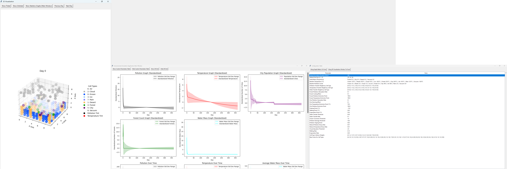

# Cellular Automaton Simulation for Biological Computation (Maman 11)

## Overview
This project is a **cellular automaton simulation** developed as an academic task for the **Biological Computation Course**. It models complex environmental interactions using a particle-based system where each cell interacts with its neighbors based on configurable properties. The project explores emergent behavior and environmental dynamics using cellular automata principles.

The entire project was developed independently by **Guy Vitelson** and is intended as a submission for the course instructor.


## Features
- **Complete Configuration Control**: Configure properties for every aspect of the simulation, including pollution dynamics, temperature changes, water transfer, and more.
- **Robust Core Logic**: The heart of the simulation lies in the `core` folder, which meticulously implements the cellular automaton behavior.
- **Real-Time Visualization**: View simulation progress through comprehensive 3D visualizations and time-series graphs.
- **Educational Focus**: Designed to demonstrate the capabilities of cellular automata for academic study and research.


## Project Structure
```plaintext
.
├── main.py                    # Main entry point for the simulation
├── cli_output.log             # Cli output exapmle 
├── config/                    # Configuration management files
│   ├── config_state_handler.py
│   └── conf_presets.py
├── core/                      # Core simulation logic (critical for behavior)
│   ├── Particle.py
│   ├── Simulation.py
│   ├── World.py
│   └── __init__.py
├── display/                   # Visualization modules
│   ├── MatplotlibDisplay.py
│   └── __init__.py
├── screenshots/               # Screenshot of the graphical interface
│   └── _GUI.png
└── utils/                     # Utility functions
    └── helpers.py
```

## Configuration Properties
The configuration properties are the foundation of this simulation. Each property can be modified to customize the behavior and environment.

### General Simulation Parameters
- `days`: Default Simulation Duration (Days).
- `grid_size`: Default Grid Size `(X, Y, Z)`.
- `initial_ratios`: Proportions of cell types (e.g., `forest`, `city`, etc.).

### Baseline Environmental Properties
- `baseline_temperature`: Baseline Temperature (°C).
- `baseline_pollution_level`: Baseline Pollution Levels.

### Pollution Transfer Weights
- `cell_type_pollution_transfer_weights`: Pollution Transfer Weights by Cell Type.

### Temperature Transfer Weights
- `cell_type_temperature_transfer_weights`: Temperature Transfer Weights by Cell Type.

### Water Transfer Weights
- `cell_type_water_transfer_weights`: Water Transfer Weights by Cell Type.

### Forest Properties
- `forest_pollution_absorption_rate`: Rate at which forests absorb pollution.
- `forest_cooling_effect`: Cooling effect of forests on the environment.
- `forest_pollution_extinction_point`: Pollution level beyond which forests die.
- `forest_temperature_extinction_point`: Temperature beyond which forests die.

### City Properties
- `city_pollution_generation_rate`: Rate of pollution generation by cities.
- `city_warming_effect`: Warming effect caused by cities.
- `city_temperature_extinction_point`: Maximum temperature for city survival.
- `city_pollution_extinction_point`: Pollution level beyond which cities collapse.

### Physical Properties
- `freezing_point`: Temperature (°C) at which water freezes.
- `melting_point`: Temperature (°C) at which ice melts.
- `evaporation_point`: Temperature (°C) at which water evaporates.

### Water Transfer Dynamics
- `water_transfer_threshold`: Minimum water mass difference for transfer.
- `water_transfer_rate`: Rate of water transfer between cells.
- `ocean_conversion_threshold`: Water mass required to convert a cell to ocean.

### Pollution Dynamics
- `pollution_damage_threshold`: Pollution level causing damage to ecosystems.
- `pollution_level_tipping_point`: Pollution level beyond which damage accelerates.
- `natural_pollution_decay_rate`: Rate at which pollution naturally decays.

### Temperature Dynamics
- `natural_temperature_decay_rate`: Rate at which temperature equalizes to baseline.

### Cloud Properties
- `cloud_saturation_threshold`: Minimum water mass for clouds to precipitate.

### Environmental Change Rates
- `melting_rate`: Rate at which ice melts.
- `evaporation_rate`: Rate at which water evaporates.

### Conversion Weights
- `cell_type_collision_weights`: Weights governing cell-type collisions.

### Base Colors
- `base_colors`: RGBA colors for each cell type.


## Installation

1. Clone this repository or download the ZIP file:
   ```bash
   git clone <repository_url>
   cd <repository_directory>
   ```

2. Install the required dependencies:
   ```bash
   pip install -r requirements.txt
   ```

## Usage Instructions

### 1. Run the Program
Start the program by executing:
```bash
python main.py
```

### 2. Choose Configuration
When prompted, select one of the following options:
1. **Default Configuration Preset**: Uses pre-defined default parameters.
2. **Choose Preset**: Select from a list of predefined presets (e.g., low pollution, high pollution).
3. **Custom Parameters**: Define every property manually.

### 3. Simulation Execution
- After selecting a configuration, the program validates it and begins the simulation.
- Progress is displayed in real time through a graphical interface.

### 4. Visualizations
- **Graphs**:
  - Pollution trends over time.
  - Average temperature and water mass.
  - Cell type population counts and standard deviations.
- **3D Visualization**:
  - Displays the grid and cell types with their interactions and transformations.

### 5. Logs and Results
- Results and metrics are logged in `cli_output.log` for further analysis.
- Metrics include averages, standard deviations, and configuration details.


## Code and Logic
### Core Components
- **`Particle.py`**: Defines the behavior of individual cells, including pollution absorption, water transfer, and type-specific interactions.
- **`Simulation.py`**: Manages the simulation lifecycle, precomputing states for multiple days and tracking metrics.
- **`World.py`**: Represents the grid and initializes particles using elevation maps.

### Visualization
- **`MatplotlibDisplay.py`**: Generates graphs and 3D visualizations.
- **Real-Time GUI**: Displays metrics and allows interaction during the simulation.


## Example Workflow

1. Run the program:
   ```bash
   python main.py
   ```
2. Choose a configuration preset or define your custom setup.
3. Observe the simulation progress through the GUI.
4. CLI output example can be found in the `cli_output.log` file.
5. GUI Screenshot 


## Academic Integrity
This project is an independent academic submission for the **Biological Computation Course**. The implementation, configuration, and logic have been designed solely by **Guy Vitelson**.


## License
This project is licensed under the MIT License.
GitHub Repo : https://github.com/v1t3ls0n/bio-computation-course

